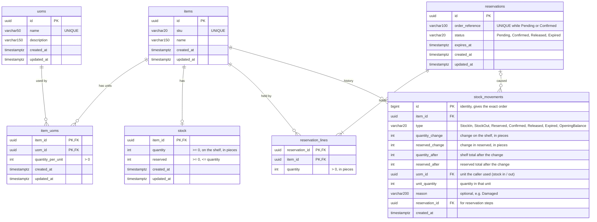

# inventory-service

Stock management microservice built with **ASP.NET Core** and **Supabase (PostgreSQL)**.
Manages items, units of measure, stock levels with unit conversion, checkout reservations and a full stock history.

## Database design



### How units work

- `item_uoms.quantity_per_unit` = how many **pieces** are inside **one** unit, for that item.
  Pepsi + BOX = 24, Water + BOX = 12.
- `stock.quantity` is **always in pieces**. 10 boxes of Pepsi are saved as `240`.
- Number of boxes is calculated, never stored: `240 / 24 = 10 boxes`.

### Design decisions

| Decision | Why |
|---|---|
| UUID v7 primary keys | Time-ordered, so inserts don't fragment the index like random UUIDs do |
| `TIMESTAMPTZ` for dates | Stores the exact moment in UTC, correct across timezones |
| `VARCHAR`, not `CHAR` | `CHAR` pads values with spaces |
| Composite PK on `item_uoms` | An item can't have the same unit twice |
| Check constraints | The database itself rejects negative stock and zero-size units |
| `RESTRICT` on delete | An item can't be deleted while stock or units still point to it |
| Timestamps set in `SaveChanges` | No endpoint can forget to update `updated_at` |
| Row Level Security on every table | Supabase's public REST API can't read or change the tables; only this API can |
| One reservation per order, with lines | An order is held completely or not at all |
| Partial unique index on `order_reference` | A retried checkout can't hold the same stock twice |
| Expiry uses the database clock | Several API instances always agree on when a reservation expires |
| Stock history written in the same transaction as the change | The history can never disagree with the stock numbers |
| `bigint` identity key on `stock_movements` | Gives the exact order of changes per item, even for changes in the same millisecond |
| `reservation_lines` and `stock_movements` kept separate | Lines are what an order holds *now* (confirm / release read them); movements are the append-only log of *what happened* |

## Project structure

```
inventory-service/
├── src/InventoryService.Api/
│   ├── Controllers/              # HTTP endpoints only, no business logic
│   ├── Services/                 # business logic (unit conversion, stock rules, reservations)
│   ├── Dtos/                     # request / response JSON shapes
│   ├── Errors/                   # exceptions -> 400 / 404 / 409 responses
│   ├── Auth/                     # X-Api-Key authentication
│   ├── Entities/                 # Item, Uom, ItemUom, Stock, Reservation, ReservationLine, StockMovement
│   ├── Data/
│   │   ├── InventoryDbContext.cs # snake_case naming + automatic timestamps
│   │   ├── Configurations/       # one file per table: keys, lengths, constraints
│   │   └── Migrations/           # EF Core migrations (already created, just apply them)
│   └── Program.cs
├── tests/InventoryService.Api.Tests/  # integration tests against a real PostgreSQL (Docker)
├── Dockerfile
├── docker-compose.yml
├── .env.example                  # template for the settings docker compose reads
├── InventoryService.slnx
└── global.json                   # pins the .NET 10 SDK
```

## Getting started

### Requirements

- [.NET 10 SDK](https://dotnet.microsoft.com/download/dotnet/10.0) (`dotnet --version` should show `10.x`)
- A Supabase project
- Docker (for running the tests or the container)

### 1. Restore packages and tools

```bash
dotnet restore
dotnet tool restore      # installs dotnet-ef for this repo
```

### 2. Connect to Supabase

In Supabase, click **Connect** → **Session pooler** and copy the host, user and password.
Then save the connection string as a **user secret** (it stays on your machine and is never committed):

```bash
dotnet user-secrets set "ConnectionStrings:InventoryDb" \
  "Host=aws-0-<region>.pooler.supabase.com;Port=5432;Database=postgres;Username=postgres.<project-ref>;Password=<your-password>;SSL Mode=Require" \
  --project src/InventoryService.Api
```

> Use the **Session pooler** (port 5432). The direct connection is IPv6-only on many networks,
> and the transaction pooler (port 6543) doesn't work well with migrations.

### 3. Set the API key

Every endpoint (except `/health`) requires an `X-Api-Key` header, and the app refuses to start without a key.
Create a long random one and save it as a user secret:

```bash
dotnet user-secrets set "Auth:ApiKey" "$(openssl rand -hex 32)" --project src/InventoryService.Api
dotnet user-secrets list --project src/InventoryService.Api   # shows the key, to paste into Swagger / Postman
```

The key must be at least 16 characters. See [Authentication](#authentication) for how callers use it.

### 4. Create the tables

The migrations are already in the repo, so you only apply them:

```bash
dotnet ef database update --project src/InventoryService.Api
```

The seven tables (plus EF's `__EFMigrationsHistory`) now appear in Supabase under **Table Editor**,
with Row Level Security enabled (Supabase shows no "RLS disabled" warning).

> When you change the entities later, create a new migration with
> `dotnet ef migrations add <Name> --project src/InventoryService.Api --output-dir Data/Migrations`.
> If it adds a table, add `ALTER TABLE <name> ENABLE ROW LEVEL SECURITY` to it (see `EnableRowLevelSecurity`).

### 5. Run

```bash
dotnet run --project src/InventoryService.Api
```

- Health check: http://localhost:5080/health (also checks the database)

  ```json
  {
    "status": "Healthy",
    "totalDurationMs": 12.4,
    "checks": [
      { "name": "database", "status": "Healthy", "description": null, "durationMs": 11.9 }
    ]
  }
  ```

  Returns `200` when healthy and `503` when the database can't be reached.
- Swagger UI: http://localhost:5080/swagger
- OpenAPI spec: http://localhost:5080/openapi/v1.json

Swagger UI and the OpenAPI spec are only served in the `Development` environment (the `http` launch profile sets it).
In Swagger, click **Authorize** and paste your API key first; it is remembered across page reloads.

### Configuration

| Setting | Where | Default | What it does |
|---|---|---|---|
| `ConnectionStrings:InventoryDb` | user secret / environment variable | none (required) | Supabase / PostgreSQL connection. The app refuses to start without it. |
| `Reservations:ExpiryMinutes` | `appsettings.json` | `15` | How long an unpaid reservation holds stock. Allowed 1–1440; anything else stops the app at startup. |
| `Auth:ApiKey` | user secret / environment variable | none (required) | Shared secret callers send in the `X-Api-Key` header. At least 16 characters; the app refuses to start without it. |

In production, set these as environment variables, using `__` instead of `:`
(e.g. `ConnectionStrings__InventoryDb`, `Reservations__ExpiryMinutes`, `Auth__ApiKey`).

## Run with Docker

1. Copy the settings template and fill in your values:

   ```bash
   cp .env.example .env
   ```

   `.env` is git-ignored, so the connection string and key never get committed.
   If your password contains a `$`, write it as `$$`.

2. Build and start:

   ```bash
   docker compose up --build
   ```

3. Check it:

   ```bash
   curl http://localhost:8080/health
   curl -H "X-Api-Key: <your key>" http://localhost:8080/uoms
   ```

   With `ASPNETCORE_ENVIRONMENT=Development`, Swagger is at http://localhost:8080/swagger.
   Set it to `Production` (the default) to turn Swagger off.

The container does not run migrations. Apply them from your machine with `dotnet ef database update` before starting a new database.

Stop it with `docker compose down`.

## API

Every endpoint below needs the `X-Api-Key` header (see [Authentication](#authentication)).

| Method | URL | What it does |
|---|---|---|
| `POST` | `/uoms` | Create a unit (name is saved in capitals: `box` → `BOX`) |
| `GET` | `/uoms` | List all units |
| `GET` | `/uoms/{id}` | Get one unit |
| `POST` | `/items` | Create an item; its stock row is created at 0 |
| `GET` | `/items?page=1&pageSize=20` | List items, one page at a time |
| `GET` | `/items/{id}` | Get one item |
| `POST` | `/items/{itemId}/uoms` | Link a unit to an item (`BOX = 24`) |
| `GET` | `/items/{itemId}/uoms` | List an item's units, biggest first |
| `POST` | `/items/{itemId}/stock/in` | Receive stock (`2 BOX` → +48 pieces) |
| `POST` | `/items/{itemId}/stock/out` | Remove stock; refused if not enough |
| `GET` | `/items/{itemId}/stock` | On shelf, reserved, available, and the shelf amount in every unit |
| `GET` | `/items/{itemId}/stock/history?page=1&pageSize=20` | Every change to the item's stock, newest first |
| `POST` | `/reservations` | Hold stock for an order (one or more items, all or nothing); safe to retry |
| `GET` | `/reservations?orderReference=...` | All reservations of an order, newest first |
| `GET` | `/reservations/{id}` | Get one reservation |
| `POST` | `/reservations/{id}/confirm` | Paid: the goods leave the shelf |
| `POST` | `/reservations/{id}/release` | Cancelled: the goods are available again |

### Reservations (checkout flow)

| Step | `quantity` (shelf) | `reserved` | available |
|---|---|---|---|
| Start | 240 | 0 | 240 |
| Reserve 48 | 240 | 48 | 192 |
| Confirm (paid) | 192 | 0 | 192 |
| *or* Release / Expire | 240 | 0 | 240 |

- **available = quantity − reserved** is calculated, never stored.
- One reservation covers a whole order: `{ "orderReference": "ORDER-1", "lines": [{ "itemId": "...", "uomId": "...", "quantity": 2 }, ...] }`.
  If any item doesn't have enough, nothing is held (409). Lines for the same item are merged.
- **Retries are safe.** An order can have only one Pending or Confirmed reservation (a unique index).
  Sending the same order again returns the existing reservation with `200` instead of `201`;
  the same order with *different* lines gets `409` (release the old one first).
- `stock/out` can only take **available** stock, never reserved stock.
- An unpaid reservation expires after `Reservations:ExpiryMinutes` (default 15, allowed 1–1440). A background job checks every minute.
  Expiry uses the database clock, so several API instances always agree.
- Every step changes the reservation and the stock of every line **in one transaction**. Stock rows are always
  locked in the same order, so two orders for the same items can't deadlock. `WHERE status = 'Pending'`
  makes each step happen only once, even if confirm and release arrive at the same moment.

There is no endpoint to set stock directly. Stock only changes through **in** and **out**,
and both run as a single atomic SQL `UPDATE`, so two requests at the same time can't overwrite each other.
Errors use the standard problem-details format (`400`, `401`, `404`, `409`).

### Stock history

Every change to stock adds one row to `stock_movements`, **in the same transaction** as the change itself,
so the history always matches the numbers. Rows are never updated or deleted.

| Type | Caused by | `quantityChange` | `reservedChange` |
|---|---|---|---|
| `StockIn` | `POST .../stock/in` | `+n` | `0` |
| `StockOut` | `POST .../stock/out` | `−n` | `0` |
| `Reserved` | `POST /reservations` (one row per item) | `0` | `+n` |
| `Confirmed` | `POST /reservations/{id}/confirm` | `−n` | `−n` |
| `Released` | `POST /reservations/{id}/release` | `0` | `−n` |
| `Expired` | the expiry job | `0` | `−n` |
| `OpeningBalance` | the migration, once: stock that existed before history was recorded | current | current |

- Every row also stores the totals **after** the change (`quantityAfter`, `reservedAfter`), so you can read
  the stock level at any point in time without adding anything up.
- Stock in / out accept an optional `reason` (max 200 characters), e.g. `{ "quantity": 3, "reason": "Damaged" }`.
  The unit and quantity the caller sent (`2 BOX`) are kept too, next to the converted pieces (`48`).
- Reservation rows carry the `reservationId`, so you can see which order held or took the stock.
- Refused requests (not enough stock, validation errors) leave no row.
- Adding up `quantityChange` over the whole history gives the current shelf quantity (same for `reservedChange`).

### Try it (in Swagger)

0. Click **Authorize** and paste your API key
1. `POST /uoms` → `{ "name": "BOX" }`, copy the `id`
2. `POST /items` → `{ "sku": "PEP-330", "name": "Pepsi 330ml Can" }`, copy the `id`
3. `POST /items/{itemId}/uoms` → `{ "uomId": "<BOX id>", "quantityPerUnit": 24 }`
4. `POST /items/{itemId}/stock/in` → `{ "uomId": "<BOX id>", "quantity": 10 }` → 240 pieces
5. `POST /items/{itemId}/stock/out` → `{ "quantity": 3, "reason": "Damaged" }` (no unit = pieces) → 237
6. `GET /items/{itemId}/stock` → 9 boxes and 21 pieces
7. `POST /reservations` → `{ "orderReference": "ORDER-1", "lines": [{ "itemId": "<id>", "uomId": "<BOX id>", "quantity": 2 }] }` → 48 pieces held
8. `POST /reservations/{id}/confirm` → 189 on the shelf
9. `GET /items/{itemId}/stock/history` → Confirmed, Reserved, StockOut, StockIn (newest first)

From the command line:

```bash
curl -H "X-Api-Key: <your key>" http://localhost:5080/uoms
```

## Authentication

Callers (the shop, the warehouse app...) authenticate with a shared secret in the `X-Api-Key` header.
The code is in `Auth/ApiKeyAuthentication.cs` and is switched on in `Program.cs` for every controller.

| Request | Result |
|---|---|
| No `X-Api-Key` header | `401` |
| Wrong key | `401` |
| Header sent twice | `401` |
| Correct key | the endpoint runs |
| `GET /health` | always open, so load balancers can check the service without a key |

- The key comes from `Auth:ApiKey` (user secret locally, `Auth__ApiKey` environment variable in production).
  To change it, set a new value and restart the app, then give the new key to the callers.
- Some tools (e.g. Postman with both the Headers and Authorization tabs filled in) send the header twice; send it once.
- Spaces or line breaks around the key (from copy-paste) are ignored.
- The key is compared in constant time, so it can't be guessed by measuring response times.
- The key protects the API only. It is not a user login: if end users (browsers, mobile apps) ever call
  this API directly, switch to JWT bearer tokens.

## Tests

Integration tests start a real PostgreSQL in Docker ([Testcontainers](https://dotnet.testcontainers.org/)),
apply the migrations and call the API in memory. They check the promises above: parallel requests never
oversell, retries don't hold twice, multi-item orders are all or nothing, confirm/release race, expiry,
every stock change appears in the history with the right totals, and requests without a valid API key are refused.
They never touch Supabase.

```bash
dotnet test      # Docker (or OrbStack / Colima) must be running
```

## Roadmap

- [x] Database design and EF Core setup
- [x] Endpoints: items, units, stock in / stock out
- [x] Reservations with automatic expiry
- [x] Stock history (every change with reason and date)
- [x] Multi-item reservations, idempotent retries
- [x] Row Level Security
- [x] API key authentication
- [x] Integration tests
- [x] Docker image
- [ ] CI pipeline
- [ ] Swagger: show enums as text, mark required fields

## License

MIT
